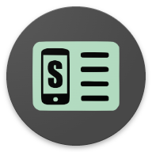

<!--suppress CheckImageSize -->
  

PPPPutSettings (PPPPS)
====================================

__PhoneProfilesPlus in Discord__
- Invitation: https://discord.com/invite/gbV7UCzt
---

### Sources of PPPPutSettings:

Use keyword "PPPPutSettings" for search this application in these stores:

__Droid-ify (F-Droid alternative):__
- [PPPPS release](https://apt.izzysoft.de/fdroid/index/apk/sk.henrichg.pppputsettings)
- [Store applicaion (download)](https://apt.izzysoft.de/fdroid/index/apk/com.looker.droidify)
  &nbsp;&nbsp;&nbsp;_IzzyOnDroid repository is included_

__Neo Store (F-Droid alternative, preferred over GitHub):__
- [PPPPS release](https://apt.izzysoft.de/fdroid/index/apk/sk.henrichg.pppputsettings)
- [Store applicaion (download)](https://apt.izzysoft.de/fdroid/index/apk/com.machiav3lli.fdroid)
  &nbsp;&nbsp;&nbsp;_IzzyOnDroid repository is included_

__F-Droid:__
- [PPPPS release](https://apt.izzysoft.de/fdroid/index/apk/sk.henrichg.pppputsettings)
  &nbsp;&nbsp;&nbsp;_[How to add IzzyOnDroid repository to F-Droid application](https://apt.izzysoft.de/fdroid/index/info)_
- [Store application (download)](https://www.f-droid.org/)

__When the dialog "Unsafe app blocked" from Google Play Protect appears during installation, click at bottom, text "More details" and in it at bottom, text "Install anyway".__

__GitHub:__
- [PPPPS release (direct download)](https://github.com/henrichg/PPPPutSettings/releases/latest/download/PPPPutSettings.apk)
&nbsp;&nbsp;&nbsp;_[Number of downloads by version](https://hanadigital.github.io/grev/?user=henrichg&repo=pppputsettings)_

__How to install PPPPutSettings (for Android 14+)__
- [How to install](docs/install_apk_in_device.md)

__If is not possible to install PPPPutSettings from the downloaded apk file directly on your device, you can install it from your computer.__
- [How to install](docs/install_apk_from_pc.md)

---
__What is PPPPutSettings:__

Android application for put settings parameter to system database without root. It is helper application for [PhoneProfilesPlus](https://github.com/henrichg/PhoneProfilesPlus).

- [Privacy Policy](https://henrichg.github.io/PhoneProfilesPlus/privacy_policy.html)

_**** Please report me bugs, comments and suggestions to my e-mail: <henrich.gron@gmail.com>. Speed up the especially bug fixes. Thank you very much. ****_

_*** Please help me with translation, thank you: <https://crowdin.com/project/phoneprofilesplus> ***_

##### Permissions
- __[Show it](docs/permissions.md)__

##### Screenshots
- [[1]](art/phoneScreenshots/01.png),
[[2]](art/phoneScreenshots/02.png),

##### Supported Android versions

- From Android 5.1
- minSdkVersion = 22
- targetSdkVersion = 22
- compiledSdkVersion = 34

##### Required external libs - open-source

- AndroidX library: appcompat, splashscreen - https://developer.android.com/jetpack/androidx/versions
- ACRA - https://github.com/ACRA/acra
- guava - https://github.com/google/guava
- AutoService = https://github.com/google/auto/tree/main/service
- Multi-language_App (only modified class LocaleHelper.java) https://github.com/anurajr1/Multi-language_App
